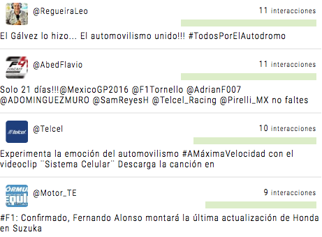

Cuando hablamos de viralidad nos referimos a cantidad de veces que el mismo contenido es compartido y mutado por las audiencias; esto es mas evidente con lo memes, el fenómeno cultural recientemente bautizado es la tropicalización o re-adaptación del contenido para generar nuevas lineas de comunicación que enganchan con valores culturales.

> Como subirse a este tren de manera constructiva, es más un asunto de forma que de control.

El modus operandi de la publicidad tradicional es controlar el mensaje y experiencia de las audiencias; sin embargo hay más de una manera en que las cosas pueden salirse de control, por lo que la realidad es que es más un asunto de saber como subirse a la ola y esperar lo mejor; cualquier contenido es sujeto a interpretación, modificación y apropiación del mismo.

El ciclo de re-creación de contenido y re-distribución es tan largo como la creatividad de las audiencias y en muchas ocasiones toman contenidos residuales y les dan un propósito nuevo para hacerlos nuevos de nuevo.

> El enfrentar el contenido negativo con censura es echarle mas leña al fuego

La mejor manera de afrontar conversiones negativas es crear contenido afín a la audiencia que queremos convertir, y aprender de este ciclo para tomarlo como parte de la cultura de la marca.

Es relevante estar al tanto de 3 verticales para la creación de contenido que se alinie con tendencias:

## 1. Efemérides Sociales

¿ Que sucedieron los años anteriores en la mismas fechas ?

Y no solo hablamos de efemérides oficiales, si no de tendencias; por ejemplo, el día del no-automóvil en septiembre nos puede permitir subir al tema de manera orgánica; preparando una pauta donde si la audiencia llega a nuestro comercio en bicicleta otorgaríamos un descuento especial.

Hace un año el día de raza generó polaridad y este es un fenómeno que se replica año con año; el preparar contenido que genere un diálogo sobre esto puede se estratégicamente valioso.

## 2. Social Listening del Sector

¿ Cual es la conversación relacionada con mi rubro (no con mi marca) ?

Este es uno de las verticales de contenido regularmente ignorada por que nos centramos en escuchar que hablan de nosotros y en algunas ocasiones sobre la competencia, pero no del producto o el concepto que nos interesa capitalizar.

Suponiendo que somos una marca relacionada con accesorios automotrices, un sector allegado es el automovilismo, estos son los twits con mayor influencia de la semana :

Y las afinidades relacionadas con las personas que hablan de automovilismo en México.

Esto nos puede dar una pauta de que información podemos compartir que sea afín a la audiencia que nos interesa; estar al tanto de noticias relacionadas con deportes y utilizar esto como pauta de creación es no perder relevancia con el día a día; recordemos que no solo es llevar gente con descuentos si no establecernos como autoridades en el tema.

Google también nos permite encontrar los contenidos relacionados con una categoría; esto ampliar nuestro radar, donde podemos en este ejemplo ver que los videojuegos son también una buena vertical de conversación.

## 3. Social Listening de la Marca y Competencia

¿Es mucho o es poco?

Esta es la parte mas obvia pero no necesariamente bien hecha por la mayoría de las empresas; el que Telcel tenga miles de quejas solo es representativo si es proporcional a la cantidad de usuarios (o en este caso de menciones) ; por lo que conocer el estándar de la categoría en cuanto a seguidores, menciones e interacciones es relevante para saber como abordar los temas y medir mas adecuadamente el éxito de la campaña de contenido.

Cada una de las marcas genera distintos tipos de audiencia; encontrar la varianza es importante si queremos ganar terreno en el mercado.

*Afinidades de Banamex*

*Afinidades de Banorte*

Si comparamos la conversación orgánica entre las personas que hablan de Banamex vs las que habla de Banorte, vemos un area de oportunidad en Entretenimiento y Estilo de Vida para Banorte donde Banamex prácticamente esta dictando la pauta de la categoría.

## Del diálogo a la contribución

Como tal las redes han abierto un canal de comunicación, sin embargo no para en solo el intercambio de quejas y conversación con clientes; la estrategia debe tomar en cuanta generar contenido que contribuya a la conversación (mas ayá del hard-sell).

Al tomar parte de esta contribución se construye una imágen de no solo proveedora de productos, si no como generadora de experiencias; al final del día si las marcas son el medio por el cual se puede generar una experiencia positiva que tenga el potencial de compartirse en mayor medida.

*Campaña Holloween de Netflix*

*Campaña Holloween de Blim*

Comprar a la audiencia para que se genere ruido puede llegar a funcionar; pero la realidad es que no es un engagemente real dado que no son el centro de la comunicación; es mejor premitir al usuario ser el que relate la historia y transforme el contenido y ser el medio para que el pueda combatirlo; más aya de fotzarlo a “probar que estas usando el producto”.

La manera adecuada de subirte a una tendencia es contribuir con contenido que ayude a explotar una tendencia sin forzarlo; una contra-tendencia es crear vínculos sin relación.

*Contenido sin relación con la marca, puede ayudar a generar ruido pero sin contexto.*

*Tomar una tendencia con un pretexto de comunicar un mensaje tiene mayor sentido aunque solo sea anunciar nuevo contenido.*

>Una campaña que solo forza a un “Call to Action” en redes sociales es la manera mas rápida de alienizarte de la audiencia; la publicidad mas efectiva seguirá siendo el de boca en boca o de mention en mention, por lo que conocer un insight puede tornarse desastroso en una campaña si no se contecta con el usuario.
