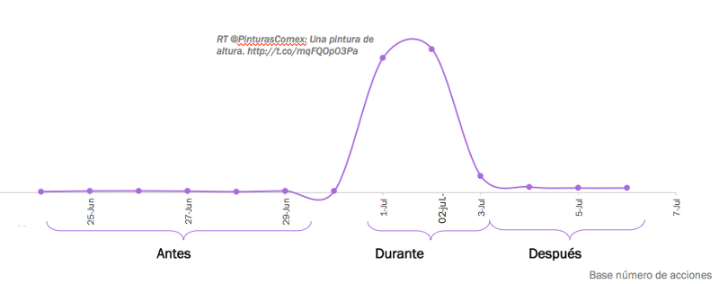
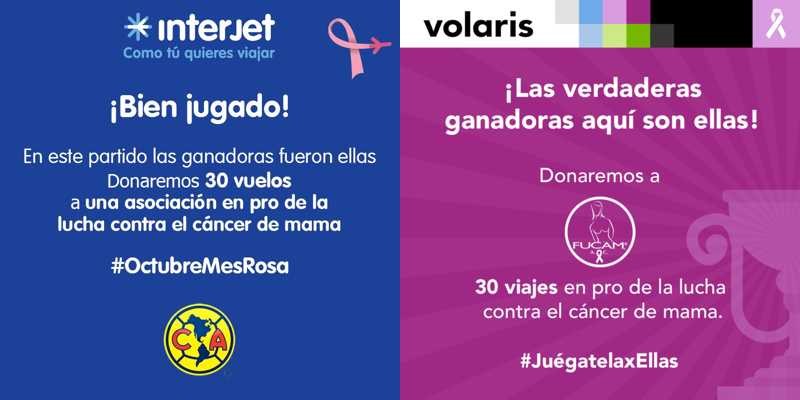
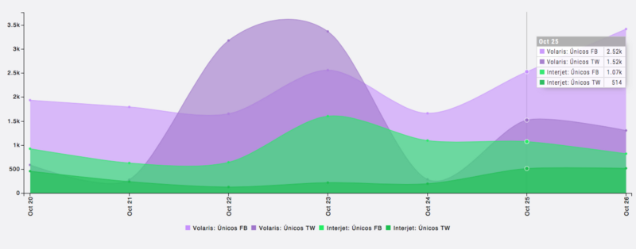
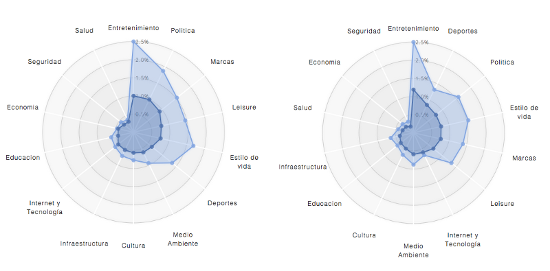
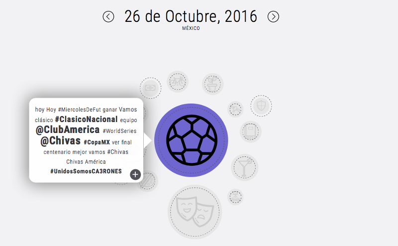
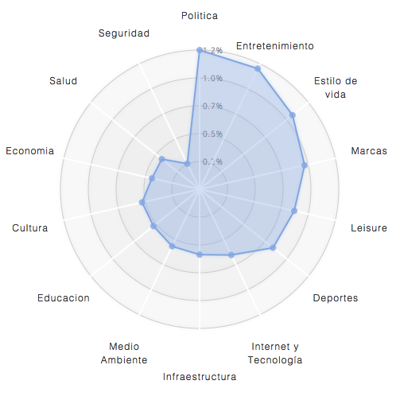

El engagement del contenido puede ser medido desde múltiples verticales, entre ellas:

-   Reacciones (Likes, Favs)
-   Comentarios / Replies
-   Retwits / Comparticiones
-   Views

Estas métricas nos ayudan a entender mejor cómo la audiencia engancha con el contenido que producimos, sin embargo, uno de los clichés más grandes del contenido es el famoso "so what?"; esto es como relacionamos el contenido que compartimos con nuestra marca y que utilidad tiene para la audiencia.

> Cuando la viralidad no se traduce en indicadores reales

El branding, cuya medición es regularmente dificil de cuantificar fuera de métricas como el "top of mind", es resultado de campañas diseñadas para mantener la marca presente en la mente del consumidor; esta vertiente de estratégias es regularmente válida para marcas cuyo funnel de venta es masivo o colateral a los esfuerzos publicitarios.

Coca-Cola, Marinela, Unilever y otras márcas de consumo masivo cuentan con mecanismos de venta masivos que no son fácilmente medibles o explicados como consecuencia de campañas en particular; esto es, si el nuevo comercial o campaña en redes sociales o televisión impacto en ventas o simplemente es resultado otro evento no necesariamente relacionado con la campaña; con la escepción de redención de cupones o incentivos directamente medibles en los puntos de venta.

Para empresas medianas y pequeñas los esfuerzos deben ser atados conversiones; estas conversiones pueden ser: cantidad de cuentas que se subscribieron al newsletter, personas que intercambiaron el cupón X de la campaña online, cantidad de leads de venta generados por medio de mensajes en facebook o en el caso idóneo, cantidad de ventas realizadas en el sitio web.

Cualquiera de los indicadores anteriores ayudan a mejor perfilar y re-alinear las campañas (ads, landings y procesos) para aumentar las conversiones; dentro de este rubro, herramientas de A/B testing cobran sentido escencial para basar la optimización en métricas científicas; los medios digitales permiten mutar el contenido para maximizar las conversiones, ejemplos de estas herramientas son : convert.com, ubounce.com, vwo y google analytics experiments.

Los fenómenos virales como el de Comex suelen durar 3 a 4 días y si una celebridad lo toma pueden extenderse.

Meme Comex :3 días, pero sin conversión a largo plazo.

En cambio campañas virales como la apuesta chivas-americas entre las compañías de Volaris e Interjet hecha el 26 Octubre 2016 se subió al tema de [#JuégatelaxEllas](https://twitter.com/hashtag/Ju%C3%A9gatelaxEllas?src=hash) para conmemorar el més del cancer de mama; genero una connotación positiva.

Banners

Apuesta Volaris-Interjet

Con este pretexto se subieron a una conversación plagada de memes, explotando la polaridad de la audiencia y alargaron la conversación creciendo su afinidad con ambas aficiones.

Afinidad de Volaris antes y Después de la campaña

Volaris aumentó su afinidad con deportes del 6to lugar de una semana antes al segundo lugar; sin publicidad en el partido televisado.

Deportes fué el tema número en México

La Costeña, quien se publicitó en el estadio el dia del partido no generó tanta afinidad ni volumen; siendo del promedio en 6to lugar al igual que todas las marcas de su categoría, lo que quiere decir que no impactó en la audiencia de deportes.

Afinidad de La Costeña, luego del partido

Al final del día, el pastel del conversación y temás lo dicta la agenda social; el aprovechar esta agenda a nustra ventaja es indispensable para obtener mas impacto con un esfuerzo mas quirurgico.

Los contenidos ya no pueden ser planeados con meses de anticipación la agenda social es en tiempo-real y tener un mecanismo que permita reaccionar es fundamental para generar conversiones orgánicas de followers a fans de las marcas.
