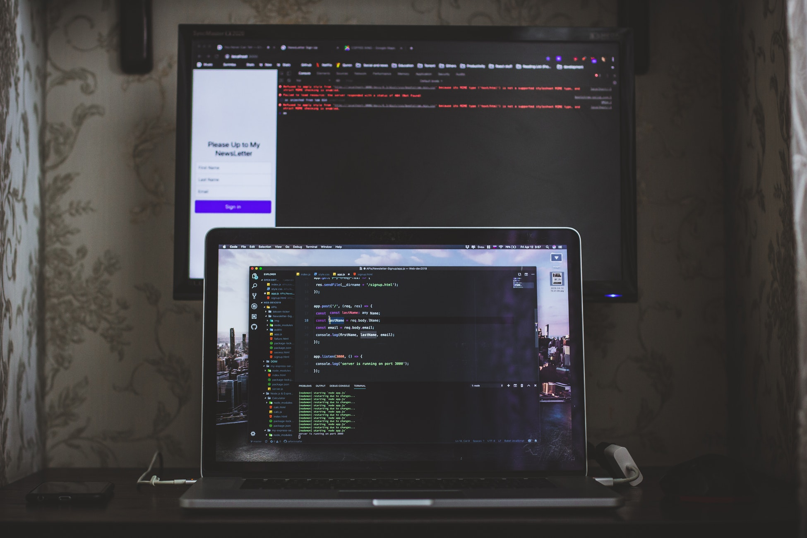

I wont’t lie if I stated there was a before and after using the NodeJS debugger on a daily basis, however, there was yet another before and after handling the debugging inside my IDE (VSCode).



Like many of you I develop NodeJS apps and a lot of the times these apps have to be handled inside of containers, because keeping track of the NodeJS versions for every app can lead to unnecessary host system complexity, sometimes you need to get several servers up simultaneously (i.e. microservices apps) and it would require to maintain multiple shell sessions to switch the NodeJS version between them; but this is not a compaint post against [nvm](https://github.com/nvm-sh/nvm), rather how I had to set it up to work inside Docker.

*.Dockerfile*
```
FROM node:8.10
COPY . /app
WORKDIR /app
RUN echo "deb [check-valid-until=no] http://archive.debian.org/debian \
jessie-backports main" > /etc/apt/sources.list.d/jessie-backports.list
RUN sed -i '/deb http:\/\/deb.debian.org\/debian jessie-updates main/d' \
/etc/apt/sources.list
RUN apt-get -o Acquire::Check-Valid-Until=false update
RUN apt-get install -yq psmisc
RUN npm install --silent
CMD ["npm", "run", "dev"]
```

Most of the setup is to be able to install [psmisc](http://psmisc.sourceforge.net/) that includes a tool called fuser, what that utility will allow us is to terminate the execution of node or rather restart it on a more stable way; for some reason when we are running the inspect flag on node we have a sticky port situation where the process hangs to the port and it will not be able to kill the connection to the attached debugger on time, so this helps; there is a node only alternative for killing processes port based, however, it was not stable enough to be useful, going system utility mode is just more stable.

And now for the package.json setup (scripts section):

```json
"scripts": {
     "test": "jest -i --bail --coverage --forceExit",
     "inspect": "fuser -k 9231/tcp; fuser -k 7070/tcp; node --inspect=0.0.0.0:9231 server.js",
     "dev": "npm install && nodemon --delay 180ms -L --config /app/nodemon.json --exec 'npm run inspect'",
     "start": "node server.js"
   }
```

Ignoring test and start which are scripts intended for devOps and production running; I am using two commands for running this app, the first one (dev) which is referred at the Dockerfile as default runs an instance of [nodemon](https://www.npmjs.com/package/nodemon) with the L flag that makes it run more stable inside of Docker with a mapped volume on the host system and an inspect command that makes it easier to read this file kills the processes that are bound to ports 9231 (in this case the debugging port and port 7070 which is my default app port, you should accommodate for your own default app port. I am also telling nodemon to pull a configuration file from nodemon.json that handles exceptions and other details.

With this setup the app will start inside of Docker waiting on a connection on ports 9231 and 7070, so it’s important to map these ports when running Docker, I normally use [docker-compose](https://docs.docker.com/compose/) do setup my environment and the ports mapped, the following is an example configuration for this particular setup.

```
backend:
  build: ./../backend
  container_name: "backend"
  ports:
    - 7070:7070
    - 9231:9231
  volumes:
    - ./../backend:/app
    - /app/node_modules
  env_file: ./../backend/.env
  depends_on:
    - mongodb
```

Using this setup helps us maintain the docker-compose file as it’s own repository and we can have an env file to maintain the session variables required for the app to run.

Now all that is left is to configure vs code to connect to the debugger, it is pretty much straight forward, create or start the VSCode debugger to have it create a folder named .vscode on the root of the project, then on a file named launch.json include:

```
{
  "version": "0.2.0",
  "configurations": [
    {
      "type": "node",
      "request": "attach",
      "name": "Docker: Attach to server",
      "port": 9231,
      "address": "localhost",
      "localRoot": "${workspaceFolder}",
      "remoteRoot": "/app/",
    },
  ]
}
```

And that’s it, just connect to the instance using F5 or re-run the app on the instance using Ctrl+Shift+F5 to restart and reconnect.

Addendum [Apr 30 2019]
You might want to skip stepping into dependencies or JavaScript internals (like promise handling) adding this to the launch.json config file of VSCode:

```
"skipFiles": 
  "${workspaceFolder}/node_modules/**/*.js",
  "<node_internals>/**/*.js"
]
```

