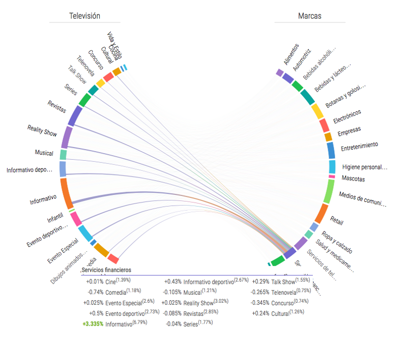

La creación de contenido de calidad no sólo se puede basar en pura inspiración y creatividad; la creación puede partir a partir de insights sobre los gustos de la audiencia, cuya relación con otros temás abre la puerta a crear contenido con mayor engagement y que pueda convertir en mayor medida de espectadores a fans participativos en el proceso de creación.

#### ¿ De que escribir ?

Hay verticales de contenido que nos ayudan a ampliar las opciones de narrativa e ir mas ayá del hard-sell; la primera es definir a groso modo cuál será el tono de con el que nos debemos comunicar, una manera de conocer mas a la audiencia es encontrar de que otros temas de comunicación está hablando la audiencia.

Por ejemplo; si fuésemos una compañía que comercializa servicios financieros para el consumidor podemos encontrar los hábitos de conversación sobre TV de las personas que hablan de productos en este sector :

El diferencial de afinidad más alto (esto es la cantidad de personas que sobresalen del promedio entre los temas de conversación) es con el genero informativo donde casi el 6.8% de las personas que hablan de empresas en el rubro de servicios financieros hablaron también de programas de TV de corte informativo; esto nos habla de una audiencia que busca información con un tono más formal.

El uso de afinidades y temáticas de contexto nacional permiten conectar más acertivamente al crear contenido que generé mayor engagement; el timing es tan importante como el tema; ahondaremos en estos temas mas adelante.
